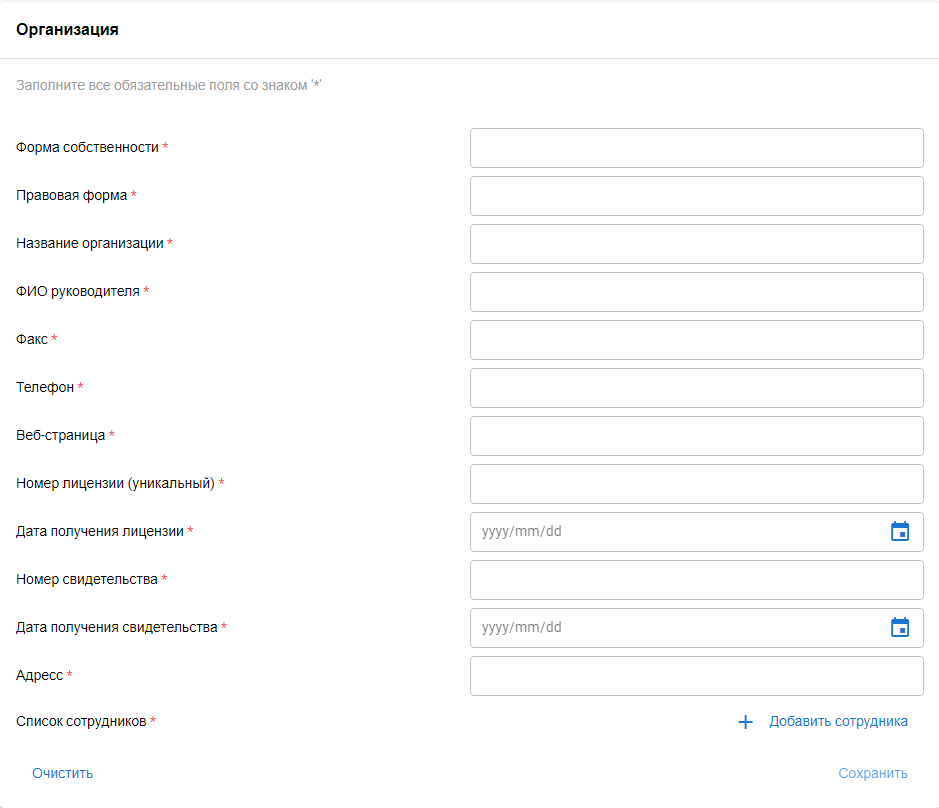
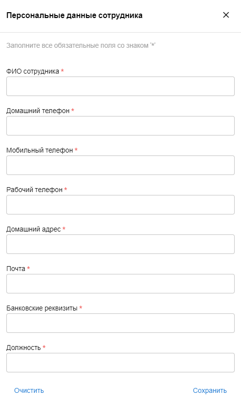
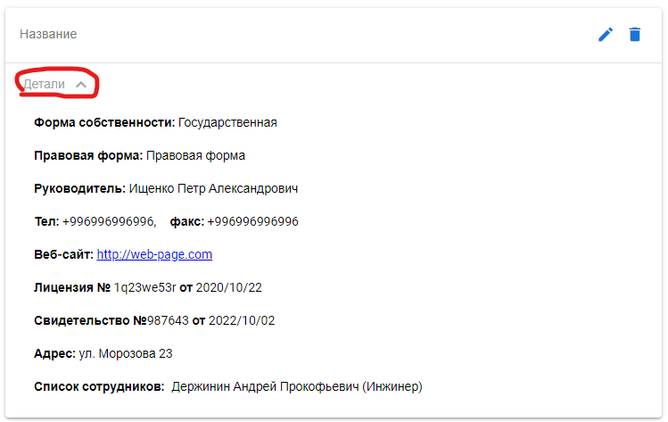
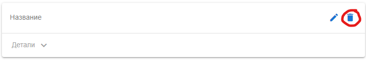

# Quasar App (test-task)

A Quasar Project

## Install the dependencies
```bash
yarn
# or
npm install
```

### Start the app in development mode (hot-code reloading, error reporting, etc.)
```bash
quasar dev
```


### Lint the files
```bash
yarn lint
# or
npm run lint
```


### Build the app for production
```bash
quasar build
```

### Customize the configuration
See [Configuring quasar.config.js](https://v2.quasar.dev/quasar-cli-webpack/quasar-config-js).


### User manual
Step 1: To create an entry, fill in all fields of the form 'Organization' <br>

####
Step 2: To add entries for employees of the organization, clock on the 'Add employee' button <br>

####
Step 3: Fill in all fields of the form 'Personal information' and click on the 'Save' button <br>

#### To edit the added employee record, click on thr edit icon (pen) next to the employee name.

####
Step 4: Check all the entered data and click on the 'Save' button
#### After saving the entry, it will be displayed on the left in the list of all organizations.

#### To view information about the organization, click on te 'Details' button of the organization you need in the list.

#### To edit the added organization record, click on thr edit icon (pen) next to the organization name.

#### Edit required fields of the form 'Organization' or employee records and repeat step 3.
#### To delete organization or employee records, click the delete icon next to the edit icon.
<br>

